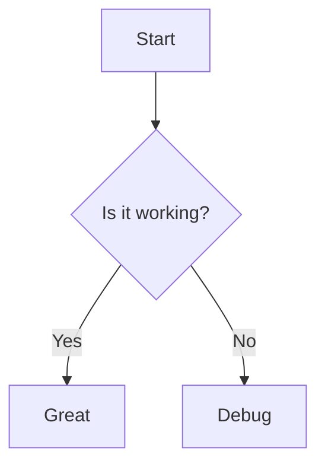
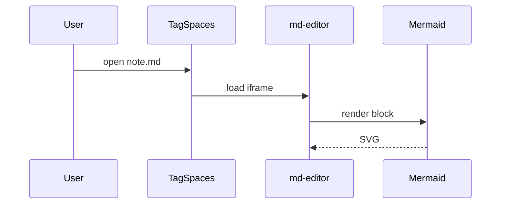

# Mermaid test

```mermaid
graph TD
  A[Start] --> B{Is it working?}
  B -- Yes --> C[Great]
  B -- No --> D[Debug]
```

```mermaid
sequenceDiagram
  User->>TagSpaces: open note.md
  TagSpaces->>md-editor: load iframe
  md-editor->>Mermaid: render block
  Mermaid-->>md-editor: SVG
```

Some text after.
